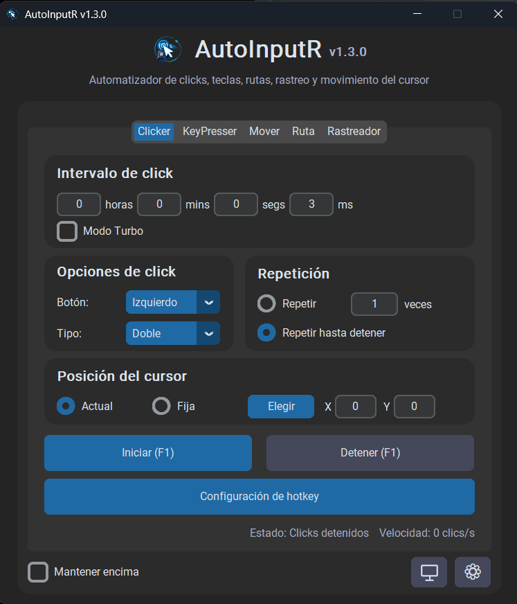

# AutoInputR

AutoInputR es una aplicación de escritorio para Windows que permite automatizar acciones del mouse y del teclado mediante una interfaz gráfica.

## Versión actual

**AutoInputR v1.3.0**

## Descargar AutoInputR

La versión oficial más reciente se encuentra en la sección **Releases** de este repositorio.

Descarga:

`AutoInputR_Setup_v1.3.0.exe`

Después:

1. Ejecuta el instalador.
2. Sigue las instrucciones mostradas.
3. Abre AutoInputR desde el acceso directo creado.

## Características

### Clicker

* Clicks automáticos con intervalos configurables.
* Click simple o doble.
* Botón izquierdo, derecho o central.
* Posición actual del cursor o coordenadas fijas.
* Repetición limitada o indefinida.
* Modo Turbo.

### KeyPresser

* Repetición automática de una tecla seleccionada.
* Intervalos configurables.
* Repetición limitada o indefinida.
* Hotkeys globales.
* Modo Turbo.

### Mover

* Movimiento automático del cursor dentro de una zona seleccionada.
* Diferentes patrones de movimiento.
* Desplazamiento suave.
* Velocidad configurable.
* Clicks periódicos para evitar inactividad.

### Ruta

* Grabación de movimientos del cursor.
* Registro de clicks durante la grabación.
* Reproducción de rutas.
* Velocidad de reproducción configurable.
* Grabación mientras otra aplicación o juego permanece enfocado.
* HUD visual durante la grabación en juego.

### Rastreador

* Selección de una zona de búsqueda.
* Captura de una imagen objetivo.
* Rastreo visual mediante plantillas.
* Movimiento suave hacia el objetivo detectado.
* Coincidencia mínima configurable.
* Micro movimientos para activar elementos mediante hover.
* Clicks periódicos anti-AFK.

### Ventana objetivo

* Selector de ventana objetivo.
* Identificación mediante título, proceso y clase.
* Automatizaciones limitadas opcionalmente a la ventana seleccionada.
* Pausa automática cuando la ventana pierde el foco.
* Reanudación automática al recuperar el foco.
* Indicador visual del estado de la ventana.
* Protección aplicada a Clicker, KeyPresser, Mover, Ruta y Rastreador.
* Recuperación de la selección después de reiniciar AutoInputR.

### Funciones generales

* Hotkeys globales configurables.
* Configuración persistente.
* Opción para mantener la aplicación encima.
* Integración con la bandeja del sistema.
* Interfaz gráfica desarrollada con CustomTkinter.

## Requisitos

* Sistema operativo Windows.
* Permisos para instalar y ejecutar aplicaciones.
* Algunas funciones pueden comportarse de manera diferente según el programa o juego utilizado.

## Uso responsable

AutoInputR es una herramienta de automatización general.

El usuario es responsable de comprobar que su utilización esté permitida por las reglas, términos y condiciones de las aplicaciones, juegos o servicios donde la ejecute.

## Código fuente

El código fuente completo de AutoInputR no se distribuye públicamente.

## Uso y derechos

Se permite descargar, instalar y utilizar gratuitamente la versión oficial compilada de AutoInputR para uso personal.

Sin autorización previa del autor, no está permitido:

* Modificar o distribuir versiones modificadas de AutoInputR.
* Redistribuir el instalador o ejecutable desde fuentes no oficiales.
* Vender, alquilar o comercializar AutoInputR.
* Presentar AutoInputR como una creación propia.
* Utilizar sus logotipos o identidad visual en productos derivados.
* Realizar ingeniería inversa, salvo cuando la legislación aplicable lo permita expresamente.

AutoInputR se proporciona tal cual, sin garantías. El autor no se responsabiliza por daños, pérdidas, sanciones o consecuencias derivadas de su utilización.

## Autor

Desarrollado por Robert.

Copyright © 2026 Robert. Todos los derechos reservados.
